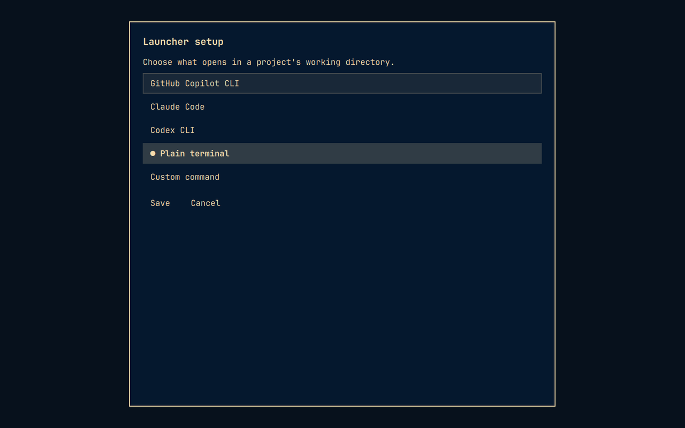

# Omarchy Project Launcher


*Project-list preview uses fictional repositories.*

An open-source Omarchy plugin for browsing Git repositories, viewing live status, and opening your preferred CLI or terminal in the selected project.

It scans direct children of `~/Projects` each time it opens. No project registration or database is required.

## Features

- View branch, changed, untracked, and ahead/behind status.
- Choose GitHub Copilot CLI (default), Claude Code, Codex CLI, a plain terminal, or a custom command from **Setup**.
- Clone a project from an HTTPS or SSH Git URL.
- Create and initialize a new Git project.
- Import an existing repository by symlink, move, or copy; symlink is the default.
- Move a project to the desktop Trash, with an additional warning for uncommitted changes.

## Install

Install from the GitHub repository with Omarchy's plugin manager:

```bash
omarchy plugin add https://github.com/u64a/omarchy-project-launcher.git --enable
```

Open the launcher with:

```bash
omarchy-shell shell summon io.github.u64a.project-launcher '{}'
```

Start typing to filter by project name, branch, or status. Use **Up/Down** to select a repository and **Enter** to open your configured launcher in its working directory.

Update an existing installation with:

```bash
omarchy plugin update io.github.u64a.project-launcher
```

Your saved launcher choice is preserved. If the old interface remains visible after an update, run `omarchy restart shell` and reopen the launcher.

Remove the plugin with:

```bash
omarchy plugin remove io.github.u64a.project-launcher
```

For a convenient Omarchy menu entry, add this to `~/.config/omarchy/extensions/omarchy-menu.jsonc`:

```jsonc
"projects": {
  "icon": "󰲋",
  "label": "Projects",
  "description": "Open a CLI or terminal for a Git repository",
  "action": "omarchy-shell shell summon io.github.u64a.project-launcher '{}'"
},
```

## Manage projects

Select **+ Add** to:

- **Clone URL** — clone an HTTPS or SSH Git URL without recursively cloning submodules.
- **Create new** — create a folder and initialize a Git repository on `main`.
- **Import folder** — symlink (recommended), move, or copy an existing Git repository into the projects folder.

Each project row includes a **Trash** action. Projects are moved to the desktop Trash, never permanently deleted. Repositories with uncommitted changes require an additional confirmation, and imported symlinks are trashed without touching their external targets.

All controls are keyboard accessible. Press **Escape** to cancel active work; otherwise it returns to the project list or closes the launcher. **Cancel** also stops an active add/import/setup/trash operation. Closing the overlay cancels its helpers, not an already launched terminal. Cancellation cannot undo a completed move, Trash action, or published project.

### Resource budgets

The plugin is intended for a modest local project collection. Limits are fixed safety policies, not environment-variable overrides. Exceeding a limit reports an error; incomplete configuration/status scans are never shown as clean or trusted.

| Work | Default limit |
| --- | --- |
| Projects-folder discovery | 4,096 direct entries (including non-projects), 256 repositories, 5 seconds |
| Complete status/list helper | 60 seconds, including discovery |
| Git configuration / status command | 5 / 10 seconds |
| Other commands / menu selection | 15 / 120 seconds |
| Settings, create, launch, or Trash helper | 30 seconds total |
| CLI scan plus interactive menu | 180 seconds total |
| Command stdout / stderr | 1 MiB / 64 KiB per stream, checked as bytes before decoding |
| Git output parsing | 20,000 records, 16,384 characters per line or NUL-delimited index/tree record, within the byte cap |
| Helper JSON / displayed error | 512 KiB / 4,096 characters |
| Settings file / individual argument or custom command | 16 KiB / 4,096 characters (at most 32 helper arguments) |
| Each Git process and its children | 512 MiB virtual address space per process |
| Clone or import | 300 seconds total; 1 GiB regular-file logical sizes, 20,000 filesystem entries, directory depth 64 |
| Each file written by clone/checkout | 128 MiB, kernel-enforced (including pack files) |

Copy inventories and copies incrementally: byte, entry, depth, and time budgets are checked before each write or creation. Symlinks are preserved without traversing their targets; special files such as FIFOs and devices are refused. Move and symlink imports receive the same bounded preflight. Moves use an atomic, non-replacing rename and **never fall back to a recursive cross-filesystem transfer**; choose Copy or Symlink across filesystems.

Clones support local paths and remote URLs. They disable local hardlink optimizations and initially skip checkout, inspect configuration and the HEAD tree for unsupported submodules, then check out without submodule recursion under the same budget. The resulting index is checked before publication. Git's staging tree is inventoried while it runs (at most 100 ms between checks, plus inventory time), and checked again before publication. **The 1 GiB/20,000-entry clone thresholds are monitored cancellation thresholds, not filesystem quotas:** Git can overshoot between inventories. The independent 128 MiB per-file kernel limit is strict; filesystem metadata also consumes space. Leave free disk headroom. The plugin is not a filesystem sandbox.

Clone, copy, and create use private `.launcher-stage-*` folders under the projects root and publish only on success, without replacing existing destinations. Cancellation removes only that operation's staging tree, never the import source or unrelated paths. Cleanup has a 5-second budget; if it cannot finish, the error identifies the staging folder for manual removal. Do not delete unrelated `.launcher-stage-*` folders belonging to other running operations.

Each command runs in a supervised process group. On timeout, overflow, or cancellation, the helper sends TERM, allows 0.3 seconds, then KILL and up to 0.7 seconds to reap. The overlay's broker gives its worker up to 7 seconds to unwind commands and staging cleanup; parent-death signaling also covers shell teardown. Overlay watchdogs are 80 seconds for listing, 50 for settings, and 320 for operations, with a final KILL after 9 seconds if graceful cancellation stalls. Both QML streams use immediate chunks, not unlimited end-of-stream or partial-line buffers (512 KiB plus a newline for stdout, 8 KiB for stderr).

For larger projects, use your normal terminal's Git/copy tools outside the plugin and organize the configured projects folder into a smaller collection. A project exceeding status/configuration limits remains unavailable in the launcher rather than showing partial results. These limits do not apply to the detached terminal or the CLI you launch.

## Configuration

### Launcher setup

Select **Setup** beside **+ Add**, choose a launcher, and press **Save**. Copilot remains the default until you save another choice.



| Option | Command required |
| --- | --- |
| GitHub Copilot CLI | `copilot` |
| Claude Code | `claude` |
| Codex CLI | `codex` |
| Plain terminal | No AI CLI required |
| Custom command | Your executable and arguments |

Unavailable launchers are marked **not installed**. Commands must be available in the Omarchy shell's `PATH`, or use an absolute executable path for a custom command. Nothing is installed automatically.

Every launcher starts in the selected repository's working directory. Custom commands support quoted arguments (for example, `my-tool --profile "work projects"`), but are not interpreted by a shell: pipes, redirects, environment-variable expansion, and command substitution are not supported. A leading `~` in the executable path is expanded.

Preferences are saved only when you press **Save**, in `${XDG_CONFIG_HOME:-~/.config}/omarchy-project-launcher/settings.json`, outside the plugin installation so updates preserve them. **Cancel** leaves the saved choice unchanged. Missing commands or invalid settings are reported in the app; open **Setup** to choose another launcher.

### Projects folder

By default, direct children of `~/Projects` are scanned each time the overlay opens. Set `OMARCHY_PROJECTS_ROOT` in the Omarchy shell environment to use another folder.

The launcher deliberately does not maintain a project registry or cache: adding or removing a repository is reflected the next time it opens.

### Repository configuration trust

Status scans refuse local content filters; imports also refuse other executable configuration. Configuration read failures and resource-limit failures always refuse the operation.

**Inspection never fetches.** Configuration, index, tree, revision, and status commands run with `GIT_NO_LAZY_FETCH=1`, `-c protocol.allow=never`, and an empty `GIT_ALLOW_PROTOCOL` whitelist. The whitelist blocks all transports (including local files and external remote helpers), even if repository/global `protocol.<name>.allow` settings permit them or Git ignores the newer lazy-fetch variable. These per-command environment overrides do not change your shell, saved configuration, explicit clone transport, or launched terminal. Post-clone inspection and checkout are local-only too.

**Partial/promisor repositories are unsupported.** Any local `extensions.partialClone`, `remote.<name>.promisor`, or `remote.<name>.partialCloneFilter` key is refused case-insensitively, even if `false` or all objects are present. Missing-object inspection failures report unavailable status rather than downloading objects. Use a complete clone without partial/promisor configuration; do not simply remove these settings from an incomplete repository. Imports also refuse command-bearing `remote.<name>.uploadpack`, `.receivepack`, `.vcs`, and `core.gitProxy` settings. Ordinary remote URLs, including GitHub HTTPS/SSH URLs, remain supported.

Local Git config includes are **not supported**, even when harmless: any `include.*`, `includeIf.*` (including inactive conditions), or `extensions.worktreeConfig` key (even `false`) is refused case-insensitively. The launcher lists local keys with `--no-includes` and rejects indirections instead of trusting hidden configuration. It also refuses `.git` files/symlinks, symlinked `.git/config`, `commondir`, and any `config.worktree`. Consequently linked worktrees and separate Git directories cannot be scanned or imported. Ordinary repository-folder symlink imports still work.

**Submodules are unsupported.** After configuration checks, a bounded, NUL-delimited index inspection refuses any mode-`160000` gitlink, including unpopulated submodules and conflict stages, before status or any import method. A top-level config check cannot establish trust in a submodule's independent configuration, which Git status could otherwise execute through filters. Known gitlinks produce an explicit unverified-status error, never a clean result; Trash requires extra confirmation. Missing `.gitmodules` or settings that ignore submodules do not bypass this restriction.

Checks precede status/import and repeat after copying, before publication. Status additionally uses `--ignore-submodules=all` as defense in depth against an index changing after inspection, not as a substitute for refusing known gitlinks. Untracked embedded repositories remain untracked entries: status does not inspect their content filters, and the launcher does not certify their configuration for later manual use. Index/tree inspection uses the existing 15-second command, byte, record, and memory limits; failures refuse the operation. Trusted user/global Git settings and includes remain effective except for the transport boundary above and fsmonitor, hooks, and pagers disabled for hardened Git operations. Use a trusted terminal outside the launcher for repositories requiring unsupported configuration or submodules; review [SECURITY.md](SECURITY.md) before changing them. These restrictions do not alter the resource budgets above.

## Requirements

- Omarchy Quattro with plugin support
- Python 3.10 or newer
- Git
- `xdg-terminal-exec`
- Your selected launcher (Copilot by default); no AI CLI is needed for **Plain terminal**

The plugin runs unsandboxed with normal user permissions, as all Omarchy plugins do. It reads Git metadata, can create/clone/import project folders at the user's request, and can move a selected project to the desktop Trash after confirmation. It never requires elevated privileges. Review [SECURITY.md](SECURITY.md) for the security model and reporting process.

## Marketplace readiness

The repository contains the required manifest, QML entry point, license, documentation, tests, and CI workflow. Before publishing a release, run the Omarchy validator and QML linter on an Omarchy installation.

## Development

Run tests:

```bash
python -m unittest discover -s tests -v
```

Validate the plugin on an Omarchy installation:

```bash
omarchy plugin validate .
qmllint -I "$OMARCHY_PATH/shell" BoundedProcess.qml ProjectLauncher.qml
```

The `bin/omarchy-project-launcher --list` command is useful for checking discovery without opening a UI.

When Quickshell is installed, the unittest suite also runs an isolated offscreen streaming-collector test with tiny injected budgets. No network or large resource loads are needed.

## License

MIT. See [LICENSE](LICENSE).
