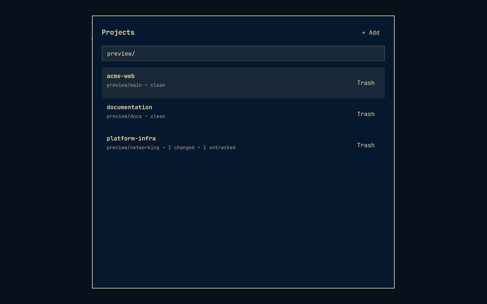

# Omarchy Project Launcher



An open-source Omarchy plugin for browsing Git repositories, viewing live status, and opening a new GitHub Copilot CLI session in the selected project.

It scans direct children of `~/Projects` each time it opens. No project registration or database is required.

## Features

- View branch, changed, untracked, and ahead/behind status.
- Open GitHub Copilot CLI in a selected repository.
- Clone a project from an HTTPS or SSH Git URL.
- Create and initialize a new Git project.
- Import an existing repository by symlink, move, or copy; symlink is the default.
- Move a project to the desktop Trash, with an additional warning for uncommitted changes.

## Install

Install from the GitHub repository with Omarchy's plugin manager:

```bash
omarchy plugin add https://github.com/u64a/omarchy-project-launcher.git --enable
```

The plugin can be summoned with:

```bash
omarchy-shell shell summon io.github.u64a.project-launcher '{}'
```

Remove it with:

```bash
omarchy plugin remove io.github.u64a.project-launcher
```

For a convenient Omarchy menu entry, add this to `~/.config/omarchy/extensions/omarchy-menu.jsonc`:

```jsonc
"projects": {
  "icon": "󰲋",
  "label": "Projects",
  "description": "Open a Copilot session for a Git repository",
  "action": "omarchy-shell shell summon io.github.u64a.project-launcher '{}'"
},
```

## Configuration

By default, direct children of `~/Projects` are scanned each time the overlay opens. Set `OMARCHY_PROJECTS_ROOT` in the Omarchy shell environment to use another folder.

The launcher deliberately does not maintain a project registry or cache: adding or removing a repository is reflected the next time it opens.

Use **+ Add** to clone, create, or import a project. Each project row has a **Trash** action. Trash removal is limited to direct children of the configured projects folder and never uses permanent deletion. Imported symlinks are themselves moved to Trash; their external targets are left untouched.

## Requirements

- Omarchy Quattro with plugin support
- Python 3.10 or newer
- Git
- `xdg-terminal-exec`
- GitHub Copilot CLI (`copilot`)

The plugin runs unsandboxed with normal user permissions, as all Omarchy plugins do. It reads Git metadata, can create/clone/import project folders at the user's request, and can move a selected project to the desktop Trash after confirmation. It never requires elevated privileges. Review [SECURITY.md](SECURITY.md) for the security model and reporting process.

## Marketplace readiness

The repository contains the required manifest, QML entry point, license, documentation, tests, and CI workflow. Before publishing a release, run the Omarchy validator and QML linter on an Omarchy installation.

## Development

Run tests:

```bash
python -m unittest discover -s tests -v
```

Validate the plugin on an Omarchy installation:

```bash
omarchy plugin validate .
qmllint -I "$OMARCHY_PATH/shell" ProjectLauncher.qml
```

The `bin/omarchy-project-launcher --list` command is useful for checking discovery without opening a UI.

## License

MIT. See [LICENSE](LICENSE).
